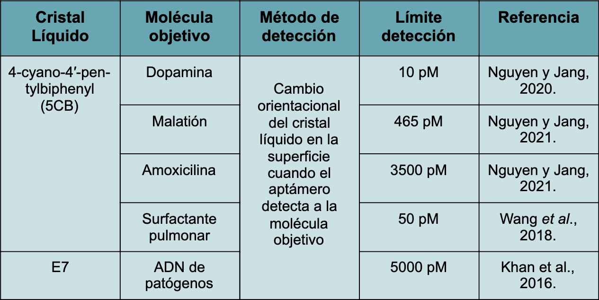
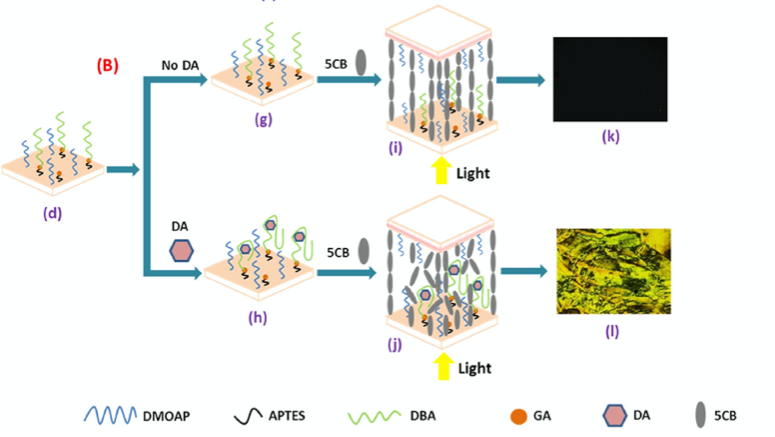
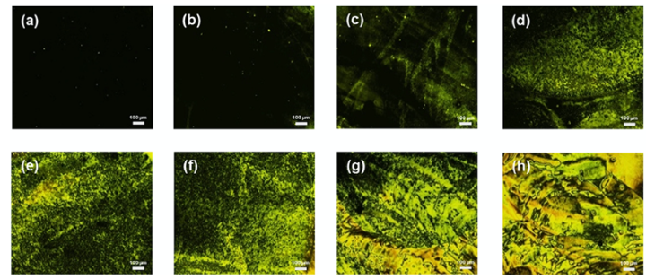
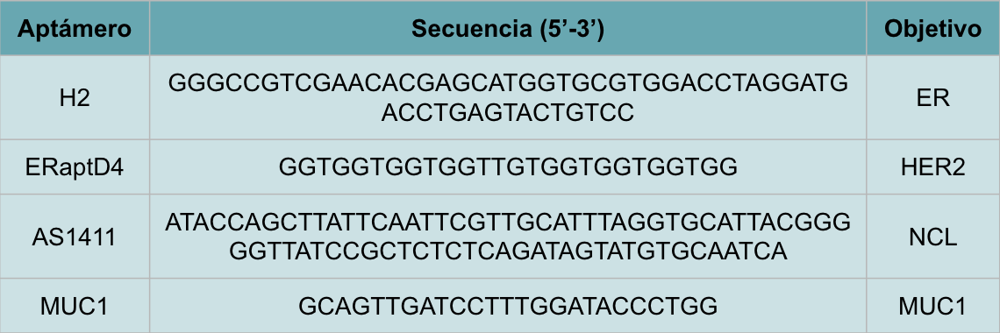

# Oncosensor para la detección del cáncer de mama
  
## Introducción

### Cáncer de mama

El cáncer de mama es el tipo de cáncer más común y la segunda causa de muerte por cáncer entre las mujeres de América. Cada año
se presentan más de 462,000 casos nuevos y casi 100,000 muertes por cáncer de mama. En México es el tumor más frecuente entre
las mujeres por lo que es la primer causa de muerte por cáncer, cada dos horas una mujer muere por esta causa en México

¿Qué es el cáncer de mama? entendemos como cáncer de mama al tumor maligno que se origina en las células de la mama, dando por
concepto  tumor maligno al grupo de células que crecen de manera desordenada e independiente, que tiende a invadir los tejidos
que lo rodean, así como órganos distantes (metástasis) dando por hecho que el cáncer de mama no solo acepta a mujeres sino
también a hombres.

Las mujeres diagnosticadas con cáncer de mama en etapas iniciales, si reciben tratamiento, tienen un buen pronóstico, con tasas
de supervivencia del 80% al 90 %. Lamentablemente, en México, la mayoría de las mujeres son diagnosticadas en etapas tardías.
Si se tuviera un método eficaz y de menor costo para la detección temprana y del tipo de cáncer de mama el número de casos y
muertes se podría reducir en hasta un 70%, inclusive en zonas remotas y marginadas del país.

Sin embargo el uso de cristales líquidos y aptámeros podría darle solución a este problema ya que, por ejemplo, su desarrollo
e implementación no tiene un gran costo a comparación de estudios genéticos y en combinación con el uso de aptámeros los vuelve
muy eficientes para la detección específica de marcadores tumorales.

### Crsitales líquidos

Los cristales líquidos son materiales que poseen propiedades intermedias: pueden fluir como un líquido pero también poseen
orden orientacional de corto alcance como los sólidos cristalinos y combinan la fluidez con la anisotropía óptica y aparece
el efecto de la birrefringencia. Estas propiedades pueden utilizarse para resolver diferentes problemáticas como lo es la
detección de una molécula en particular.

Las sustancias que forman cristales líquidos están formadas por moléculas con una forma alargada o de disco de esta manera
pueden tener sus centros de gravedad posicionados al azar (desorden posicional) pero mantener su orientación en una dirección
determinada (orden orientacional) y es esto lo que crea la estructura ordenada de un cristal líquido.

Los áptameros con secuencias cortas no-codificantes de ADN o ARN diseñadas para unirse específicamente a moléculas con alta
afinidad y presentan varias ventajas sobre los anticuerpos como es su bajo costo y su estabilidad.

## Metodología

Se propone implementar el sensor desarrollado por Nguyen y Jang (2021), pero adaptándolo con aptámeros específicos para los
marcadores tumorales de cáncer de mama, ya que este sensor detecta hasta 10pM de la muestra, siendo el más bajo encontrado
en la literatura, lo que quiere decir que no se necesita una gran cantidad de muestra para llevar a cabo una prueba.



El cristal líquido que se utiliza es el 4-ciano-4’pentilbifenil o 5CB y es de tipo nematico. Pasa de estado cristalino a
estado nematico a una temperatura de 24ºC y de estado nematico a estado isotrópico a 35ºC.


El sensor consiste en Monocapas autoensambladas de cloruro de dimetiloctadecil [3 (trimetoxisilil) propil] amonio (DMOAP)
inmovilizadas en portaobjetos de vidrio que mantienen las moléculas del 5CB en una orientación homeotrópica. Se utiliza al
glutaraldehído  para inmovilizar el aptámero sobre el DMOAP.

La unión específica del aptámero y el marcador tumoral interrumpe la orientación homeotrópica del 5CB, induciendo así un
cambio una alineación aleatoria que se puede convertir y visualizar simplemente como una transición de una imagen óptica
oscura a una imagen más brillante bajo un microscopio óptico polarizado (POM) que permite la detección del marcador tumoral





El tipo de muestra que se utilizará para el sensor será una biopsia líquida, o sangre, ya que estas muestras se realizan de
manera no invasiva en el paciente y se puede detectar el cáncer de mama en etapas tempranas además de monitorear los efectos
de un tratamiento sobre la progresión de este cáncer (Roy et al., 2021).

## Resultados

Existen diferentes tipos de marcadores tumorales que se producen en las células en respuesta al cáncer de mama. Las proteínas
ER (receptor de estrógeno) y HER2 (receptor de factor de crecimiento epidérmico 2) van a expresarse dependiendo de qué tipo de
cáncer se presente (Liu et al., 2017).

La proteína NCL (nucleolina) es un marcador de la formación de tumores, por lo que puede indicar el efecto que un tratamiento
está teniendo en un paciente y la proteína MUC1, marcador de la metástasis del cáncer o tumor maligno, que su expresión está
relacionada con la etapa del cáncer de mama (Horm & Schroeder, 2013; Wolfson et al., 2018).


Por lo tanto, se propone utilizar los aptámeros H2, ERaptD4, AS1411 y MUC1 para hacer un diagnóstico del tipo de cáncer, del
efectividad de un tratamiento y de la predisposición que tiene una persona al cáncer de mama para su tratamiento temprano
(Liu et al., 2017).



Existen 4 tipos de cáncer de mamá  en donde se pueden expresar o no los marcadores del receptor de estógeno (ER) y del receptor
de factor de crecimiento epidérmico 2(HER2) y algunos tratamientos seran efectivos o no, por lo tanto, es importante detectar el
tipo de cáncer que esta presentando el paciente.


Por ejemplo, para una prueba diagnóstico del tipo de cáncer de mama, en los marcadores ER y HER2 escriba "+" si la prueba es
positiva y "-" si la prueba es negativa:


```python
er=input("ER:")
her=input("HER2:")
if er=="+" and her=="-":
  print("Cáncer tipo Luminal A. Se puede aplicar quimioterapia y tratamientos hormonales.")
elif er=="+" and her=="+":
  print("Cáncer tipo Luminal B. Se puede aplicar quimioterapia, tratamientos hormonales y dirigidos a HER2.")
elif er=="-" and her=="+":
  print("Cáncer tipo HER2+. Se puede aplicar tratamientos dirigidos a HER2.")
elif er=="-" and her=="-":
  print("Cáncer tipo basal. Se puede aplicar quimioterapia.")
```

Como control positivo se propone usar el aptámero para el gen BRCA1, ya que está presente en todas las células y por lo tanto siempre
será positivo.


## Conclusión

Hemos propuesto el desarrollo de un sensor de marcadores tumorales a base del cristal líquido 5CB y de aptámeros para detectar: la
predisposición que tiene un paciente al cáncer de mama. El tipo de cáncer de mamá El efecto del tratamiento sobre la progresión del
cáncer de mama.

Sin embargo, algunas consideraciones a tomar en cuenta es que el cristal líquido 5CB tiene un rango de temperatura de transición de
24ºC a 35ºC, por lo que el lugar donde se tome la muestra debe, preferiblemente, estar a temperatura ambiente, entre 27ºC-30ºC, para
que no se tengan falsos positivos en las pruebas diagnóstico.

## Referencias

Horm, T. M., & Schroeder, J. A. (2013). MUC1 and metastatic cancer. Cell Adhesion & Migration, 7(2), 187–198. 10.4161/cam.23131

Liu, M., Yu, X., Chen, Z., Yang, T., Yang, D., Liu, Q., … He, N. (2017). Aptamer selection and applications for breast cancer
diagnostics and therapy. Journal of Nanobiotechnology, 15(1). doi:10.1186/s12951-017-0311-4

Nguyen, D. K. & Jang, C.-H. (2020). Label-free liquid crystal-based biosensor for detection of dopamine using T DNA aptamer as a
recognition probe. Analytical Biochemistry, 605.

Roy, D., Pascher, A., Juratli, M. A. & Sporn, J. C. (2021) The Potential of Aptamer-Mediated Liquid Biopsy for Early Detection of
Cancer. Int. J. Mol. Sci., 22(11). 10.3390/ijms22115601

Wolfson, E., Solomon, S., Schmukler, E., Goldshmit, Y., & Pinkas-Kramarski, R. (2018). Nucleolin and ErbB2 inhibition reduces
tumorigenicity of ErbB2-positive breast cancer. Cell Death & Disease, 9(2). 10.1038/s41419-017-0067-7
  
## Equipo 

- Arisbelt Hernández Toscano
- Arlett Vanessa Salinas Gerardo
- Denisse Seguey López Castro
- Pablo Orlando García Díaz
