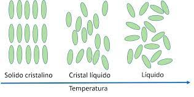

# Oncosensor para la detección del cáncer de mama
  
## Introducción

### Cáncer de mama

El cáncer de mama es el tipo de cáncer más común y la segunda causa de muerte por cáncer entre las mujeres de América. Cada año
se presentan más de 462,000 casos nuevos y casi 100,000 muertes por cáncer de mama. En México, es el tumor más frecuente entre
las mujeres por lo que es la primer causa de muerte por cáncer. Cada dos horas una mujer muere por esta causa en México y se
estima que para el 2040 se presentaran mas de 46000 casos por año de cáncer de mama como se muestra en la figura 1.

**Figura 1.** Casos por año del cáncer de mama.

Entendemos como cáncer de mama al tumor maligno que se origina en las células de la mama, dando por concepto de tumor maligno al
grupo de células que crecen de manera desordenada e independiente, que tiende a invadir los tejidos que lo rodean, así como órganos
distantes (metástasis) así como se muestra en la mamografía de la figura 2. Una mamografía es un estudio de rayos X que se utiliza
para dianósticar cáncer de mama, pero por lo regular ya cuando esta en etapas mas avanzadas.

**Figura 2.** Mamografía. 

Las mujeres diagnosticadas con cáncer de mama en etapas iniciales, si reciben tratamiento, tienen un buen pronóstico, con tasas
de supervivencia del 80% al 90 %. Lamentablemente en México, la mayoría de las mujeres son diagnosticadas en etapas tardías.
Si se tuviera un método eficaz y de menor costo para la detección temprana y del tipo de cáncer de mama el número de casos y
muertes se podría reducir en hasta un 70%.

Sin embargo, lo que aprendimos durante el Club 5 "Cristales líquidos en tus celulas y en tu celular" es que aprovechando las
propiedades físicas de los cristales líquidos como sensores, se podría darle solución a este problema, atendiendo el **objetivo
de desarollo sostenible 3: salud y bienestar**. El dessarolo de sensores de cristales líquidos no tiene un gran costo a comparación
de estudios genéticos y en combinación con el uso de aptámeros los vuelve muy eficientes para la detección específica de marcadores
tumorales, sobre todo en zonas remotas y marginadas del país.

### Crsitales líquidos

Los cristales líquidos son materiales que poseen propiedades intermedias: pueden fluir como un líquido pero también poseen
orden orientacional de corto alcance como los sólidos cristalinos y combinan la fluidez con la anisotropía óptica y aparece
el efecto de la birrefringencia como se muestra en la figura 3. Estas propiedades pueden utilizarse para resolver diferentes
problemáticas como lo es la detección de una molécula en particular.
 

**Figura 3.** Efecto de la birrenfringencia de un cristal líquido visto con un microscopio polarizado.

Las sustancias que forman cristales líquidos están formadas por moléculas con una forma alargada o de disco de esta manera
pueden tener sus centros de gravedad posicionados al azar (desorden posicional) pero mantener su orientación en una dirección
determinada (orden orientacional) y es esto lo que crea la estructura ordenada de un cristal líquido.

Por otra parte, los áptameros con secuencias cortas no-codificantes de ADN o ARN diseñadas para unirse específicamente a moléculas
con alta afinidad como se muestra en la figura 4. Presentan varias ventajas sobre los anticuerpos como es su bajo costo de producción
y su estabilidad.

**Figura 4.** Unión específica de un aptámero a su molecula objetivo.

## Metodología

Se propone implementar el sensor desarrollado por Nguyen y Jang (2021), pero adaptándolo con aptámeros específicos para los
marcadores tumorales de cáncer de mama, ya que este sensor detecta hasta 10pM de la muestra, siendo el más bajo encontrado
en la literatura, que se muestran en la Tabla 1, lo que quiere decir que no se necesita una gran cantidad de muestra
para llevar a cabo una prueba.

**Tabla 1. Comparación de sensores de cristales líquidos mediante el uso de aptámeros.**

El cristal líquido que se utiliza es el 4-ciano-4’pentilbifenil o 5CB y es de tipo nematico. Pasa de estado cristalino a
estado nematico a una temperatura de 24ºC y de estado nematico a estado isotrópico a 35ºC como se muestra en la figura 5.

**Figura 5.** Cambios de fases del 5CB.

El sensor consiste en monocapas autoensambladas de cloruro de dimetiloctadecil [3 (trimetoxisilil) propil] amonio (DMOAP)
inmovilizadas en portaobjetos de vidrio que mantienen las moléculas del 5CB en una orientación homeotrópica. Se utiliza al
glutaraldehído  para inmovilizar el aptámero sobre el DMOAP.

La unión específica del aptámero y el marcador tumoral interrumpe la orientación homeotrópica del 5CB, induciendo así un
cambio a una alineación aleatoria que se puede convertir y visualizar simplemente como una transición de una imagen óptica
oscura a una imagen más brillante bajo un microscopio óptico polarizado (POM) que permite la detección del marcador tumoral.

Por lo tanto, si la molecula a detectar esta presente en el microscopio se observara una imagen negra o obscura, en cambio,
si la molecula esta presente, se observara una imagen con luz como se muestra en la figura 6.

**Figura 6.** Funcionamiento del oncosensor.

El tipo de muestra que se utilizará para el sensor será una biopsia líquida, o sangre, ya que estas muestras se realizan de
manera no invasiva en el paciente y se puede detectar el cáncer de mama en etapas tempranas además de monitorear los efectos
de un tratamiento sobre la progresión de este cáncer (Roy et al., 2021).

## Resultados

Existen diferentes tipos de marcadores tumorales que se producen en las células en respuesta al cáncer de mama. Las proteínas
ER (receptor de estrógeno) y HER2 (receptor de factor de crecimiento epidérmico 2) van a expresarse dependiendo de qué tipo de
cáncer se presente (Liu et al., 2017).

La proteína NCL (nucleolina) es un marcador de la formación de tumores, por lo que puede indicar el efecto que un tratamiento
está teniendo en un paciente y la proteína MUC1, marcador de la metástasis del cáncer o tumor maligno, que su expresión está
relacionada con la etapa en que se encuentra el cáncer de mama (Horm & Schroeder, 2013; Wolfson et al., 2018).

**Tabla 2. Marcadores tumorales a detectar en la prueba**

Por lo tanto, se propone utilizar los aptámeros H2, ERaptD4, AS1411 y MUC1, que se muestran en la Tabla 3 para hacer un diagnóstico
del tipo de cáncer, de la efectividad de un tratamiento y de la predisposición que tiene una persona al cáncer de mama para su
tratamiento temprano y su prevención (Liu et al., 2017).

**Tabla 3. Aptámeros a utilizar con el oncosensor.**

Existen 4 tipos de cáncer de mamá  en donde se pueden expresar o no los marcadores del receptor de estógeno (ER) y del receptor
de factor de crecimiento epidérmico 2(HER2) y algunos tratamientos seran efectivos o no, como se muestra en la Tabla 4 marcados
con una "O", por lo tanto, es importante detectar el tipo de cáncer que esta presentando el paciente.

**Tabla 4. Tipos de cáncer de mama**

En el siguiente link de [Google Colab](https://colab.research.google.com/drive/1vZsmu1tS6uh8dV-xZO0OMinHxB2j-_jk?usp=sharing) ,por ejemplo, para una prueba diagnóstico del tipo de cáncer de mama, en los marcadores ER y HER2 escriba "+" si la prueba es positiva y "-" si la prueba es negativa, para saber el tipo de cáncer que es y que tratamiento será efectivo.

Como control positivo se propone usar el aptámero para el gen BRCA1, ya que está presente en todas las células y por lo tanto siempre
será positivo.

Por ejemplo, si el tratamiento para el cáncer esta teniendo efecto, se esperaría que bajo el microscopio se viera una imagen oscura con
poca detección de birrefringencia, de igual manera si el cáncer se encuentra en etapas tempranas como las imagenes de la primera fila de
la figura 6. Sin embargo si el tratamiento no está teniendo efecto o esta en etapas tardías (metástasis), bajo el microscopio se vería
mucha birrefringencia, como las imagenes de la última fila de la figura 7.

**Figura 7.** Diferentes resultados posibles que se pueden obtener en una prueba.

## Conclusión

Hemos propuesto el desarrollo de un sensor de marcadores tumorales a base del cristal líquido 5CB y de aptámeros para detectar la
predisposición que tiene un paciente al cáncer de mama, el tipo de cáncer de mamá y el efecto del tratamiento sobre la progresión del
cáncer de mama.

Sin embargo, algunas consideraciones a tomar en cuenta es que el cristal líquido 5CB tiene un rango de temperatura de transición de
24ºC a 35ºC, por lo que el lugar donde se tome la muestra debe, preferiblemente, estar a temperatura ambiente, entre 27ºC-30ºC, para
que no se tengan falsos positivos en las pruebas diagnóstico.

## Video

<iframe width="560" height="315" src="https://www.youtube.com/embed/fRf95Tv7YXA" title="YouTube video player" frameborder="0" allow="accelerometer; autoplay; clipboard-write; encrypted-media; gyroscope; picture-in-picture" allowfullscreen></iframe>

## Referencias

Horm, T. M., & Schroeder, J. A. (2013). MUC1 and metastatic cancer. Cell Adhesion & Migration, 7(2), 187–198. 10.4161/cam.23131

Liu, M., Yu, X., Chen, Z., Yang, T., Yang, D., Liu, Q., … He, N. (2017). Aptamer selection and applications for breast cancer
diagnostics and therapy. Journal of Nanobiotechnology, 15(1). doi:10.1186/s12951-017-0311-4

Nguyen, D. K. & Jang, C.-H. (2020). Label-free liquid crystal-based biosensor for detection of dopamine using T DNA aptamer as a
recognition probe. Analytical Biochemistry, 605.

Roy, D., Pascher, A., Juratli, M. A. & Sporn, J. C. (2021) The Potential of Aptamer-Mediated Liquid Biopsy for Early Detection of
Cancer. Int. J. Mol. Sci., 22(11). 10.3390/ijms22115601

Wolfson, E., Solomon, S., Schmukler, E., Goldshmit, Y., & Pinkas-Kramarski, R. (2018). Nucleolin and ErbB2 inhibition reduces
tumorigenicity of ErbB2-positive breast cancer. Cell Death & Disease, 9(2). 10.1038/s41419-017-0067-7
  
## Equipo 

- Arisbelt Hernández Toscano
- Arlett Vanessa Salinas Gerardo
- Denisse Seguey López Castro
- Pablo Orlando García Díaz

## Colaboraciones

Les presentamos en los siguientes links la metdología de dección de otras enfermeddes mediante sensores de cristales líquidos y que
fueron desarollados por nuestros compañeros del Club 5:

- [Problemas neurológicos causados por covid-19](https://cdecmx-org.github.io/proyectos-2021-club_5_2/)
- [Cáncer de colon](https://cdecmx-org.github.io/proyectos-2021-club_5_1/)

